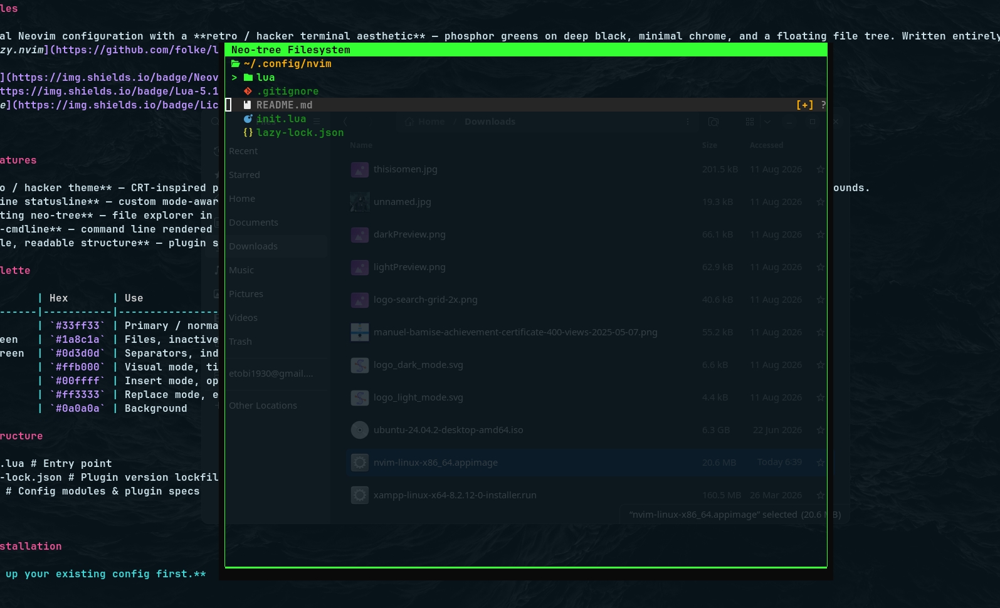
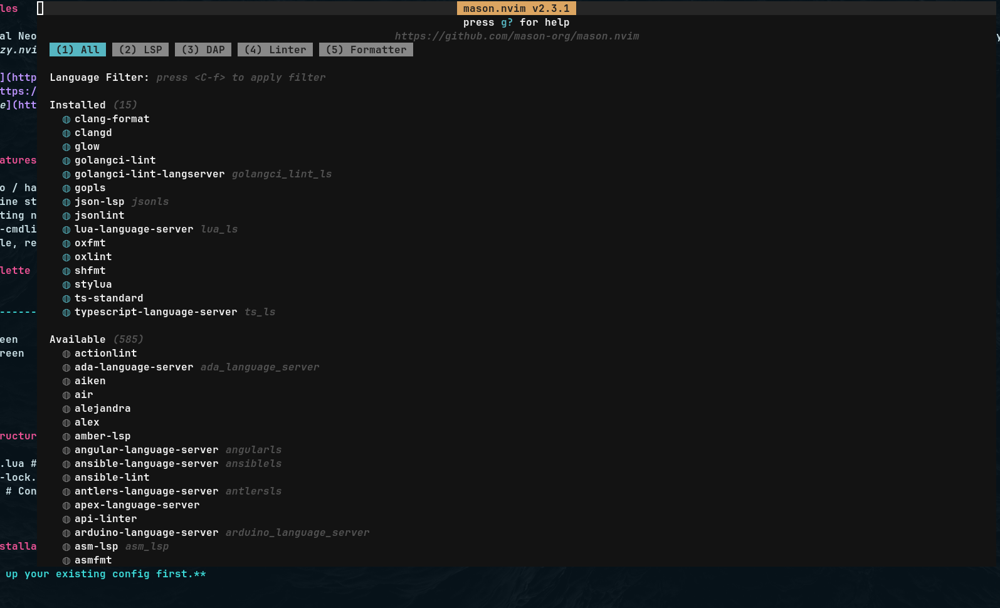
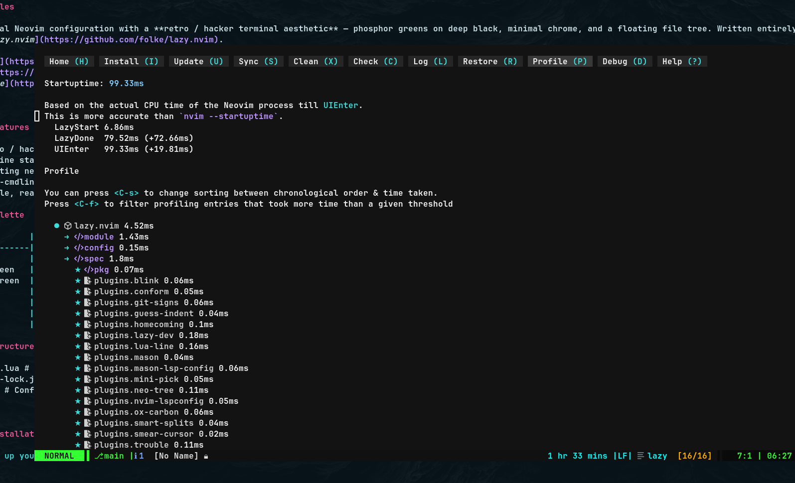

# nvimFiles

A personal Neovim configuration with a **retro / hacker terminal aesthetic** — phosphor greens on deep black, minimal chrome, and a floating file tree. Written entirely in Lua and managed with [lazy.nvim](https://github.com/folke/lazy.nvim).


---

## ✨ Features

- **Retro / hacker theme** — CRT-inspired palette of phosphor green (`#33ff33`), amber (`#ffb000`), and cyan (`#00ffff`) on near-black backgrounds.
- **Lualine statusline** — custom mode-aware colors, buffer counter, hostname, clock, and command-mode indicator.
- **Floating neo-tree** — file explorer in a centered floating window with plain-text folders and no icon clutter.
- **Tiny-cmdline** — command line rendered center-screen in matching retro style.
- **Simple, readable structure** — plugin specs split into `lua/` modules, managed with lazy.nvim.

## 📁 Structure
.
├── init.lua # Entry point
├── lazy-lock.json # Plugin version lockfile
└── lua/ # Config modules & plugin specs

text

## 🚀 Installation

> **Back up your existing config first.**

```bash
# Backup
mv ~/.config/nvim ~/.config/nvim.bak
mv ~/.local/share/nvim ~/.local/share/nvim.bak
```

# Clone
```git clone https://github.com/manuelbamise/nvimFiles.git ~/.config/nvim```

# Launch — lazy.nvim will bootstrap and install plugins
nvim
Requirements
Neovim 0.9+ (0.10+ recommended)

git (for plugin installation)

A Nerd Font (optional — icons are minimal by design)

A terminal with true-color support

Leader key is <Space>. See lua/ for the full mapping set.

🔌 Plugins
Plugin	Purpose
lazy.nvim	Plugin manager
lualine.nvim	Statusline
neo-tree.nvim	File explorer
tiny-cmdline.nvim	Centered command line
plenary.nvim	Lua utilities
nui.nvim	UI components

🛠️ Customization
Colors — palette tables live at the top of each plugin spec (lualine, tiny-cmdline, neo-tree highlights).

Splits & navigation — see the keymap section of init.lua / lua/config/.

Neo-tree filters — .git is hidden while .gitignore and .env stay visible via filtered_items in the neo-tree spec.

📸 Screenshots



📄 License
MIT

